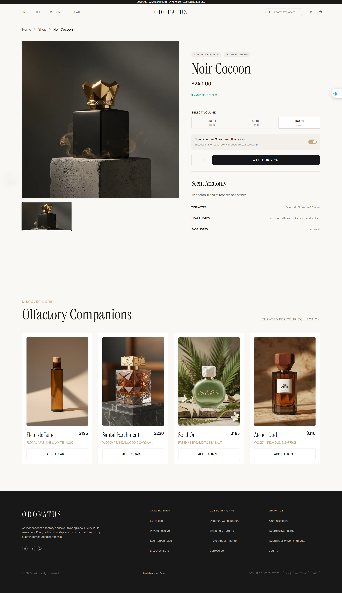

# Fragrances Store

<p align="center">
  
</p>

## 🔗 Live Demo

[**View Live Project →**](https://fragrances-project.vercel.app/)

## 📌 About The Project

**Fragrances Store** is a modern and responsive e-commerce storefront for browsing fragrances, viewing product details, and managing products in a shopping cart.

This project was developed as a **practical task during the Front-End Bootcamp**, in collaboration between **EraaSoft** and **iCareer**.

## ✨ Features

* Product browsing
* Search, filtering, and sorting
* Product details
* Shopping cart
* Responsive design

## 🛠️ Tech Stack

* Next.js
* TypeScript
* React
* Tailwind CSS
* TanStack Query
* Zustand
* Jest & Cypress

## 🚀 Getting Started

```bash
npm install
npm run dev
```

Open `http://localhost:3000` in your browser.

> Product data is currently provided through mock data. No backend is included in this project.

---

**Built as part of the EraSoft × iCareer Front-End Bootcamp.**

By Ahmed Ezzat.